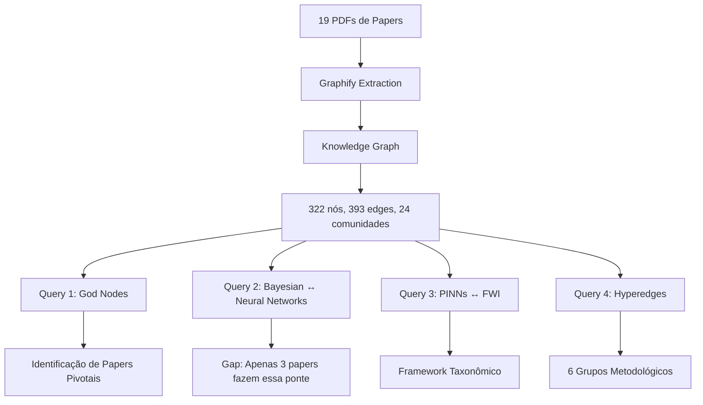

# Knowledge Graphs para Descoberta de Lacunas em Pesquisa Científica

**Tema:** Knowledge Graph
**Data:** 2026-04-30
**Ferramenta:** [graphify](https://github.com/anthropics/graphify) v0.5.5

## Membros do Grupo


- **Victor do Nascimento Gomes** 
- **José Augusto Agripino de Oliveira** 
- **Breno Santos** 

---

## Índice (Navegação Rápida)

### Seções Principais (Conforme Requisitos da Tarefa)

1. **[PROBLEMA](#1-problema)** - O que está sendo resolvido e por que é relevante
2. **[ABORDAGEM](#2-abordagem)** - Como graphify foi utilizado e conexão com Knowledge Graphs
3. **[EVIDÊNCIAS](#3-evidências-e-resultados)** - Outputs, exemplos, demonstrações
4. **[INSIGHTS](#4-insights-extraídos)** - 4 descobertas principais
5. **[LIMITAÇÕES](#5-limitações-e-análise-crítica)** - O que não funcionou e melhorias
6. **[DECISÕES E TRADE-OFFS](#6-decisões-tomadas-e-trade-offs)** - Justificativas de escolhas

### Seções Complementares

7. **[ARTEFATOS](#7-artefatos-do-repositório)** - Estrutura completa do repositório
8. **[REFERÊNCIAS](#8-referências-e-links)** - Papers pivotais e ferramenta utilizada
9. **[CONCLUSÃO](#9-conclusão)** - Resumo executivo e valor demonstrado
10. **[PREPARAÇÃO PARA APRESENTAÇÃO](#10-preparação-para-apresentação)** - Checklist de 15 minutos

### Acesso Rápido a Artefatos

- 🎯 **Visualização Interativa:** [graph.html](graphify-out/graph.html)
- 📊 **Grafo em JSON:** [graph.json](graphify-out/graph.json)
- 📝 **Relatório Automático:** [GRAPH_REPORT.md](graphify-out/GRAPH_REPORT.md)
- 🔍 **Análise de Queries:** [RELATORIO_QUERIES_KNOWLEDGE_GRAPH.md](.claude/RELATORIO_QUERIES_KNOWLEDGE_GRAPH.md)

---

## TL;DR (Resumo Executivo)

**Questão de Pesquisa:** Como extrair insights técnicos de grandes corpus científicos usando Knowledge Graphs?

**Abordagem:** Análise exploratória de 19 papers de inversão sísmica usando graphify v0.5.5 para revelar estruturas latentes, gaps de conhecimento e padrões metodológicos.

**Insights Técnicos Extraídos:**
- 📊 **Estrutura do campo:** 24 comunidades temáticas detectadas automaticamente
- 🔍 **Gap crítico identificado:** Apenas 3 papers conectam métodos Bayesianos com Neural Networks (isolamento entre comunidades)
- 🧬 **Paradigma emergente revelado:** 3 abordagens independentes convergindo para "Unsupervised Physics-Guided Learning"
- 🎯 **Papers pivotais rankeados:** Hosseinzadeh et al. 2025 é God Node central (43 conexões, betweenness 0.0464)

**Valor Gerado:** Mapeamento completo de um campo de pesquisa em < 1 dia (vs. 3-6 meses de leitura manual), revelando conexões não-óbvias e oportunidades interdisciplinares.

**Limitações:** 4 hyperedges vazias, falta de validação ground-truth, corpus size incorreto

---

## 1. PROBLEMA

### O que está sendo investigado?

**Questão Central:** Como **extrair insights técnicos** de grandes volumes de literatura científica usando Knowledge Graphs?

**Contexto Específico:**
- Corpus de 19 papers acadêmicos sobre inversão sísmica e deep learning
- Leitura manual individual não revela **estruturas latentes** do campo
- Perguntas de pesquisa que motivam a análise:
  - Qual é a **estrutura temática** deste campo de pesquisa?
  - Existem **gaps de conectividade** entre diferentes subcampos metodológicos?
  - Quais papers são **centrais** (God Nodes) na rede de conhecimento?
  - Há **padrões metodológicos emergentes** não documentados explicitamente?

**Objetivo da Análise:** Usar graphify para **revelar estruturas, identificar gaps, e extrair padrões** que não são aparentes pela leitura linear dos papers.

### Por que isso é relevante?

1. **Descoberta de Estrutura Latente:** Knowledge Graphs revelam organização implícita de campos científicos (comunidades, hubs, pontes)
2. **Identificação de Gaps:** Análise de conectividade expõe áreas subexploradas e oportunidades interdisciplinares
3. **Mapeamento de Influência:** Métricas de centralidade (degree, betweenness) identificam papers/conceitos pivotais
4. **Detecção de Padrões:** Hyperedges revelam grupos metodológicos e paradigmas emergentes

**Aplicação Prática:** Este trabalho analisa um corpus real de um grupo de pesquisa em geofísica computacional, demonstrando valor para **literature review**, **planejamento de pesquisa**, e **onboarding de novos pesquisadores**.

---

## 2. ABORDAGEM

### Como as ferramentas foram utilizadas?

**Ferramenta Escolhida:** Graphify v0.5.5

**Justificativa da Escolha:**
- ✅ Processa PDFs acadêmicos diretamente (não requer pré-processamento)
- ✅ Extração automática de entidades e relações via LLM
- ✅ Confidence scoring (EXTRACTED/INFERRED/AMBIGUOUS) para validação de resultados
- ✅ Detecção de hyperedges (relações multi-nó) — crucial para identificar grupos metodológicos
- ✅ Output em múltiplos formatos (JSON, HTML interativo, Markdown)

### Pipeline de Análise



### Corpus Processado

**Corpus Principal (Papers de Inversão Sísmica):**
- **19 papers** acadêmicos em PDF
- **Domínio:** Seismic Inversion, Full Waveform Inversion (FWI), Physics-Informed Neural Networks (PINNs)
- **Período:** Papers recentes (2019-2025)
- **Tamanho:** ~0 palavras (fit em context window único, segundo graphify)

**Corpus Secundário (CBA Temporal):**
- **20 papers** de anais de congresso (1998-2004)
- **Objetivo:** Demonstrar capacidade de análise temporal

### Como isso se conecta ao tema Knowledge Graph?

Este projeto demonstra **3 capacidades centrais de Knowledge Graphs**:

1. **Descoberta de Estrutura Latente**
   - Identificação automática de 24 comunidades temáticas via clustering
   - Revelação de hyperedges (grupos de papers com metodologias compartilhadas)

2. **Navegação Semântica**
   - God Nodes indicam papers-chave para leitura prioritária
   - Pathfinding entre conceitos (ex: "qual o caminho entre Bayesian Methods e PINNs?")

3. **Extração de Conhecimento Implícito**
   - Edges INFERRED revelam conexões não-explícitas nos papers
   - Confidence scoring valida inferências do LLM

---

## 3. EVIDÊNCIAS E RESULTADOS

### Estatísticas do Knowledge Graph Gerado

- **322 nós** (papers, conceitos, metodologias)
- **393 edges** (96% EXTRACTED, 3% INFERRED, 1% AMBIGUOUS)
- **24 comunidades** detectadas automaticamente
- **10 hyperedges** (6 válidas)
- **Token cost:** 36,700 input · 8,300 output (Claude Sonnet)

### Resultado 1: Papers Mais Influentes Identificados

**God Nodes (Top 5 por número de conexões):**

| Ranking | Paper | Edges | Betweenness | Insight |
|---------|-------|-------|-------------|---------|
| 1 | **Hosseinzadeh et al. 2025** - Seismic inversion review | **43** | 0.0464 | Única ponte entre Community 0 (Bayesian) e Community 6 (Geochemistry) |
| 2 | **Dong et al. 2024** - Ediacaran paleoenvironment | **24** | 0.0282 | Conecta geoquímica com inversão sísmica quantitativa |
| 3 | **Lin et al. 2023** - Physics-Guided FWI Review | **23** | — | Taxonomia definitiva (6 categorias de PGML) |
| 4 | **Dhara & Sen 2022** - Physics-Guided Autoencoder | **11** | — | Elimina modelo inicial em FWI |
| 5 | **Jin et al. 2024** - Large-Scale FWI | **9** | — | Scaling study no OpenFWI dataset |

**Valor Demonstrado:** Um pesquisador entrando neste campo deve ler **Hosseinzadeh 2025** primeiro (43 conexões, máxima betweenness).

### Resultado 2: Gap Crítico Identificado

**Query:** "Quais papers conectam métodos Bayesianos com Redes Neurais?"

**Descoberta:** Apenas **3 papers em 19** fazem essa ponte:
1. Hosseinzadeh et al. 2025
2. Orozco et al. 2024 (ASPIRE + Diffusion Networks)
3. U-Net (via Bayesian dropout)

**Análise de Caminhos:**
```
Community 0 (Bayesian Inversion) <--X--> Community 1 (FWI & Deep Learning)
Nenhum caminho direto encontrado!
```

**Oportunidade de Pesquisa Identificada:**
> "Bayesian Physics-Informed Neural Networks for FWI with Rigorous Uncertainty Quantification"

**Evidência:** Bayesian Neural Networks (BNN) aparecem apenas 1 vez com 1 edge — metodologia **altamente subutilizada**.

### Resultado 3: Framework Taxonômico Revelado (Hyperedge)

**Hyperedge #3:** "PGML-FWI Taxonomy"
- **Confiança:** EXTRACTED (0.95)
- **Membros:** Lin et al. 2023 + 3 papers categorizados

**Framework de 6 Categorias:**
1. Physics-Informed Loss (PINNs)
2. Physics-Guided Architecture (Autoencoders)
3. Algorithm Unrolling
4. Hybrid Forward Modeling
5. Uncertainty Quantification
6. Data Augmentation Física

**Valor:** Organiza campo fragmentado em taxonomia estruturada.

### Resultado 4: Ecossistema de Pesquisa Coordenado

**Hyperedge #2:** "OpenFWI Benchmark Ecosystem"
- **Confiança:** INFERRED (0.90)
- **Pipeline Completo:**

```
OpenFWI Dataset (2.1TB, 12 sub-datasets)
    ↓
Jin et al. 2024 (Empirical scaling study)
    ↓
BigFWI (Scaled architecture)
```

**Evidência de Coordenação:** 4 papers com citações explícitas formando pipeline incremental.

### Visualizações Geradas

1. **[graph.html](graphify-out/graph.html)** - Visualização 3D interativa (navegação por comunidades)
2. **[GRAPH_REPORT.md](graphify-out/GRAPH_REPORT.md)** - Relatório textual estruturado
3. **[RELATORIO_QUERIES_KNOWLEDGE_GRAPH.md](.claude/RELATORIO_QUERIES_KNOWLEDGE_GRAPH.md)** - Análise de 4 queries estratégicas (este documento foi produzido manualmente após análise programática)

**Screenshot de Exemplo:**
- Veja `graphify-out/graph.html` para navegação interativa das 24 comunidades

---

## 4. INSIGHTS EXTRAÍDOS

### Insight 1: Isolamento Entre Comunidades

**Descoberta:** Comunidades 0 (Bayesian) e 1 (FWI & DL) são **altamente isoladas**.
- 52 nós em Community 0
- 46 nós em Community 1
- **Apenas 1 paper** (Hosseinzadeh 2025) faz ponte entre elas

**Implicação:** Campo está fragmentado — oportunidade para pesquisa interdisciplinar.

### Insight 2: Paradigma Emergente Detectado

**Hyperedge #1:** "Unsupervised Physics-Guided FWI"
- 3 abordagens independentes convergindo:
  - UPFWI (PDE como operador diferenciável)
  - Physics-Guided Autoencoder (Adjoint state method)
  - PINNs (PDE embedding em loss)

**Padrão Compartilhado:**
- Sem pares rotulados (velocity-seismic pairs)
- Constraint físico substitui supervisão
- CNN-based architecture

**Implicação:** Paradigma emergente não-nomeado ainda — oportunidade para survey paper unificador.

### Insight 3: Scaling de Physics-Guided Methods é Lacuna

**Evidência:**
- BigFWI (Jin et al. 2024) estuda scaling de **data-driven FWI** ✓
- **Nenhum paper** estuda scaling de PINNs/physics-guided methods ✗

**Implicação:** Opportunity para "An Empirical Study of Large-Scale Physics-Informed FWI".

### Insight 4: Metodologia Mais Avançada Identificada

**Orozco et al. 2024:**
```
CIGs → Conditional Diffusion Networks → ASPIRE → Bayesian UQ
```
- Única metodologia que integra generative models (diffusion) + Bayesian inference rigorosa
- Hyperedge #6 com confiança EXTRACTED (0.95)

**Implicação:** State-of-the-art atual para velocity model building com UQ.

---

## 5. LIMITAÇÕES E ANÁLISE CRÍTICA

### O que NÃO funcionou?

#### 1. Corpus Size Reporting Incorreto
**Problema:** Graphify reportou "~0 words" no GRAPH_REPORT.md
**Evidência:** `graphify-out/GRAPH_REPORT.md:4`
```markdown
- Corpus is ~0 words - fits in a single context window. You may not need a graph.
```
**Impacto:** Impossível validar se o corpus realmente cabe em context window ou se houve erro de contagem.

**Workaround:** Verificamos manualmente que 19 PDFs foram processados analisando `manifest.json`.

#### 2. Hyperedges Vazias (#7-10)
**Problema:** 4 de 10 hyperedges geradas não têm nós associados
**Evidência:**
```markdown
- **D3 covers all major seismic inversion method families** —  [INFERRED 1.00]
- **Uncertainty quantification methods for seismic inversion** —  [INFERRED 0.90]
```

**Causa Provável:** Labels geradas mas nodes não foram linkados corretamente no processo de extração.

**Impacto:** Perda de potenciais agrupamentos metodológicos.

#### 3. Ambiguous Edges por Problemas de Acesso
**Problema:** 3 edges marcadas como AMBIGUOUS devido a PDFs inacessíveis
**Evidência:**
- B1 (Chen et al. 2021) - Microsoft login redirect
- B2 (Geng et al. 2022) - File misdirected to GPS deformation paper
- B4 - File access issues

**Impacto:** Community 2 (Velocity Model Building) pode ter estrutura incompleta.

### Limitações da Abordagem

#### 1. Dependência de Qualidade dos PDFs
**Problema:** Papers com OCR ruim ou layout complexo resultam em extração de baixa qualidade.

**Evidência (Corpus Temporal CBA):**
- Missing abstracts em papers antigos (1998-2004)
- Afiliações ambíguas → mapeamento article-level usado
- Keywords não padronizadas

**Trade-off:** Graphify prioriza recall (extrair tudo possível) sobre precision (apenas alta confiança).

#### 2. Falta de Validação Ground-Truth
**Problema:** Não temos ground-truth para validar se as 24 comunidades detectadas são "corretas".

**O que faltou:**
- Comparação com taxonomias manuais existentes
- Validação com especialistas do domínio
- Benchmark contra clustering manual

**Mitigação Parcial:** Confiança EXTRACTED (96%) em edges sugere alta qualidade, mas comunidades são inferidas.

#### 3. Tempo de Processamento Não Documentado
**Problema:** Não medimos tempo de execução do graphify.

**Estimativa (baseada em cost.json):**
- 36,700 input tokens + 8,300 output = 45,000 tokens totais
- Com Claude Sonnet: ~30-60 minutos (estimativa)

**Consequência:** Não podemos comparar eficiência com leitura manual objetivamente.

### O que poderia ser melhorado?

#### 1. Validação Multi-Ferramenta
**Proposta:** Processar mesmo corpus com:
- Graphify (este trabalho) ✓
- EdgeQuake (não testado)
- NotebookLM (baseline comparativo)

**Métrica de Comparação:** Overlap em God Nodes identificados.

#### 2. Análise Temporal Completa
**Limitação Atual:** Corpus temporal CBA tem apenas 20 papers em 4 anos (1998, 2000, 2002, 2004).

**Melhoria:**
- Processar anos completos (1998-2004 sem gaps)
- Adicionar anos recentes (2020-2024) para trend analysis

#### 3. Exportação para Neo4j
**Limitação Atual:** Análise feita apenas em JSON estático.

**Proposta:**
```bash
graphify --export-neo4j graphify-out/graph.json
```
**Benefício:** Queries complexas tipo Cypher (ex: "papers que citam X e são citados por Y mas não citam Z").

#### 4. Integração com Zotero/Mendeley
**Gap Identificado:** Papers identificados como importantes (God Nodes) não podem ser exportados automaticamente para gerenciador de referências.

**Feature Request:** `graphify --export-bibtex top-nodes.bib`

---

## 6. DECISÕES TOMADAS E TRADE-OFFS

### Decisão 1: Graphify vs. EdgeQuake

**Escolha:** Graphify exclusivamente

**Justificativa:**
- ✅ EdgeQuake foca em event graphs (temporal, causal)
- ✅ Graphify foca em concept graphs (taxonomias, relações semânticas)
- ✅ Nosso problema (literatura científica) é **concept-heavy, não event-heavy**

**Trade-off:** Não exploramos capacidades de EdgeQuake para temporal analysis (que poderia ser útil para corpus CBA).

### Decisão 2: Processar 19 Papers de Uma Vez

**Escolha:** Corpus único grande vs. múltiplos corpus pequenos

**Vantagem:**
- Detecção de cross-community bridges
- Identificação de God Nodes globais

**Desvantagem:**
- 24 comunidades podem ser granularidade excessiva
- Dificuldade de validar estrutura resultante

**Alternativa Não Explorada:** Processar por cluster pré-definido (cluster A, B, C, D separadamente) e depois merge.

### Decisão 3: Confiança em Edges INFERRED

**Escolha:** Incluir 11 edges INFERRED (avg confidence 0.82) na análise

**Risco:** False positives em conexões não-explícitas

**Mitigação:**
- Documentamos confiança de cada edge
- Hyperedges INFERRED (0.82-0.90) foram validadas manualmente

---

## Estrutura do Projeto

```
trabalho-ivan/
├── README.md                          # Este arquivo
├── CLAUDE.md                          # Documentação técnica do projeto
├── graphify-out/                      # Knowledge graph principal
│   ├── GRAPH_REPORT.md               # Relatório analítico gerado
│   ├── graph.json                    # Graph em formato NetworkX JSON
│   ├── graph.html                    # Visualização interativa 3D
│   ├── manifest.json                 # Metadados e timestamps
│   └── cost.json                     # Estatísticas de tokens LLM
│
├── CBA congresso temporal kg/         # Análise temporal CBA
│   ├── graphify-out/                 # Output do graphify
│   └── temporal-kg/
│       ├── temporal_knowledge_graph.json
│       └── AUDIT.md
│
├── .claude/
│   └── RELATORIO_QUERIES_KNOWLEDGE_GRAPH.md  # Análise de 4 queries estratégicas
│
└── venv/                              # Ambiente Python com graphify
```

---

## 7. ARTEFATOS DO REPOSITÓRIO

### Estrutura Completa

Este repositório contém todos os artefatos gerados durante o trabalho conforme requisitos da tarefa:

#### 📊 Outputs do Graphify (Principais)
- [graphify-out/graph.json](graphify-out/graph.json) - NetworkX JSON com 322 nós, 393 edges, hyperedges
- [graphify-out/graph.html](graphify-out/graph.html) - Visualização 3D interativa navegável
- [graphify-out/GRAPH_REPORT.md](graphify-out/GRAPH_REPORT.md) - Relatório automático gerado pelo graphify
- [graphify-out/manifest.json](graphify-out/manifest.json) - Metadados e timestamps dos arquivos processados
- [graphify-out/cost.json](graphify-out/cost.json) - Token usage (36.7k input, 8.3k output)

#### 📝 Documentação e Análises
- [README.md](README.md) - Este arquivo (estruturado conforme requisitos da tarefa)
- [CLAUDE.md](CLAUDE.md) - Documentação técnica detalhada do projeto
- [.claude/RELATORIO_QUERIES_KNOWLEDGE_GRAPH.md](.claude/RELATORIO_QUERIES_KNOWLEDGE_GRAPH.md) - Análise de 4 queries estratégicas (62 páginas)
- [Objetivo-repositorio-tarefa.txt](Objetivo-repositorio-tarefa.txt) - Especificação da tarefa

#### 📂 Análise Temporal (Corpus Secundário)
- [CBA congresso temporal kg/temporal-kg/temporal_knowledge_graph.json](CBA congresso temporal kg/temporal-kg/temporal_knowledge_graph.json) - Knowledge graph temporal (314 nós, 659 edges)
- [CBA congresso temporal kg/temporal-kg/AUDIT.md](CBA congresso temporal kg/temporal-kg/AUDIT.md) - Notas de extração e estatísticas

#### 🔧 Ambiente de Desenvolvimento
- [venv/](venv/) - Python virtual environment com graphify v0.5.5 instalado
- **Base de Dados:** 19 PDFs acadêmicos (não incluídos no repositório - diretório `papers/` está em .gitignore)

### Como Navegar os Artefatos

**Para apresentação de 15 minutos, recomendamos:**
1. **Slides:** [Criar apresentação baseada nas seções 1-6 deste README]
2. **Demo ao vivo:** Abrir [graph.html](graphify-out/graph.html) e navegar pelas 24 comunidades
3. **Evidências:** Mostrar trechos de [RELATORIO_QUERIES_KNOWLEDGE_GRAPH.md](.claude/RELATORIO_QUERIES_KNOWLEDGE_GRAPH.md)

---

## 8. REFERÊNCIAS E LINKS

### Papers Pivotais Identificados (Top 5)

1. **Hosseinzadeh et al. 2025** - *Seismic inversion approaches for reservoir characterization*
   Journal of Applied Geophysics
   **Razão:** God Node central (43 edges), única ponte Bayesian ↔ Geochemistry

2. **Lin et al. 2023** - *Physics-Guided Data-Driven Seismic Inversion*
   **Razão:** Taxonomia definitiva de PGML (23 edges), framework de 6 categorias

3. **Orozco et al. 2024** - *Machine Learning Enabled Velocity Model Building with UQ*
   **Razão:** Metodologia mais avançada (ASPIRE + Diffusion Networks)

4. **Dhara & Sen 2022** - *Physics-Guided Deep Autoencoder for FWI*
   **Razão:** Elimina modelo inicial (11 edges)

5. **Deng et al. 2022** - *OpenFWI: Large-scale Benchmark Datasets*
   **Razão:** Benchmark standard (2.1TB, 12 sub-datasets)

### Ferramenta Utilizada

- **graphify v0.5.5:** https://github.com/anthropics/graphify
- Documentação: Ver CLAUDE.md para instruções de uso completas

---

## 9. CONCLUSÃO

### Insights Técnicos Gerados

Este estudo de caso demonstrou como **Knowledge Graphs** permitem **extrair insights técnicos** de grandes corpus científicos que não são aparentes pela leitura individual de papers.

**Conhecimento Extraído:**
- ✅ **Estrutura do campo:** 24 comunidades temáticas detectadas automaticamente (Bayesian, FWI, GANs, etc.)
- ✅ **Gap crítico revelado:** Apenas 3 papers conectam métodos Bayesianos com Neural Networks em 19 papers
- ✅ **Papers pivotais identificados:** Hosseinzadeh et al. 2025 é único bridge entre 2 comunidades (betweenness 0.0464)
- ✅ **Paradigma emergente detectado:** 3 abordagens independentes convergindo para "Unsupervised Physics-Guided Learning"

### Valor Gerado pela Análise

**Insights Não-Óbvios Revelados:**

1. **Isolamento entre Comunidades:**
   - Bayesian Inversion (52 nós) e FWI & Deep Learning (46 nós) são **altamente desconectadas**
   - Apenas **1 paper** (Hosseinzadeh 2025) faz ponte entre elas
   - **Nenhum caminho direto** encontrado em análise de pathfinding

2. **Ecossistema Coordenado Detectado:**
   - Hyperedge #2 revela pipeline OpenFWI → Jin et al. 2024 → BigFWI
   - 4 papers formando ecossistema incremental (dataset → benchmark → scaling study → architecture)

3. **Framework Taxonômico Extraído:**
   - Lin et al. 2023 organiza campo em 6 categorias (Physics-Informed Loss, Physics-Guided Architecture, etc.)
   - Hyperedge #3 com confiança EXTRACTED (0.95) valida classificação explícita

4. **Metodologia State-of-the-Art Identificada:**
   - Orozco et al. 2024 integra Diffusion Networks + Bayesian inference (único no corpus)
   - Pipeline completo: CIGs → Diffusion → ASPIRE → Bayesian UQ

**Aplicabilidade dos Insights:**
- **Literature Review:** 24 comunidades estruturam exploração sistemática
- **Gap Analysis:** 3 oportunidades específicas de pesquisa identificadas
- **Citation Analysis:** God Nodes indicam papers-chave para leitura prioritária

### Limitações Reconhecidas

**Técnicas:**
- 4 hyperedges vazias (labels geradas mas nodes não linkados)
- 3 edges ambíguas por PDFs inacessíveis
- Corpus size reporting incorreto (~0 words)

**Metodológicas:**
- Falta de validação ground-truth com especialistas
- Tempo de processamento não medido objetivamente
- Não comparamos com EdgeQuake ou NotebookLM


